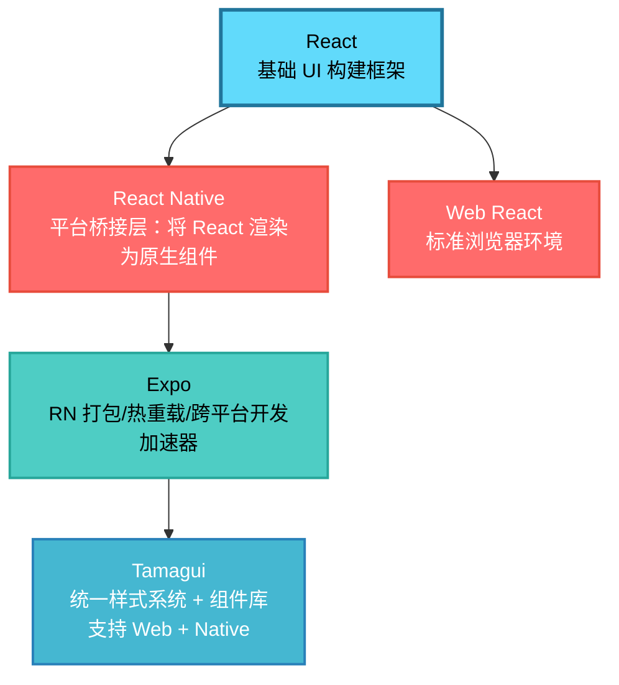
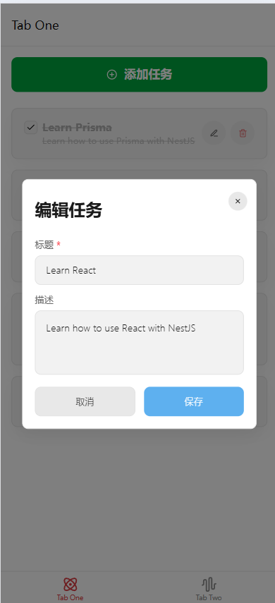

```mermaid
graph TD
    A[React<br/>基础 UI 构建框架] --> B[React Native<br/>平台桥接层：将 React 渲染为原生组件]
    A --> C[Web React<br/>标准浏览器环境]
    B --> D[Expo<br/>RN 打包/热重载/跨平台开发加速器]
    D --> E[Tamagui<br/>统一样式系统 + 组件库<br/>支持 Web + Native]

%% 样式定义
classDef reactCore fill:#61DAFB,stroke:#21759B,stroke-width:3px,color:#000
classDef platform fill:#FF6B6B,stroke:#E74C3C,stroke-width:2px,color:#fff
classDef tools fill:#4ECDC4,stroke:#26A69A,stroke-width:2px,color:#000
classDef ui fill:#45B7D1,stroke:#2980B9,stroke-width:2px,color:#fff

class A reactCore
class B,C platform
class D tools
class E ui
```

坑太多了，各种依赖不兼容，以后不玩冷门框架了，代码没怎么写，全折腾配置去了。

成果展示：

